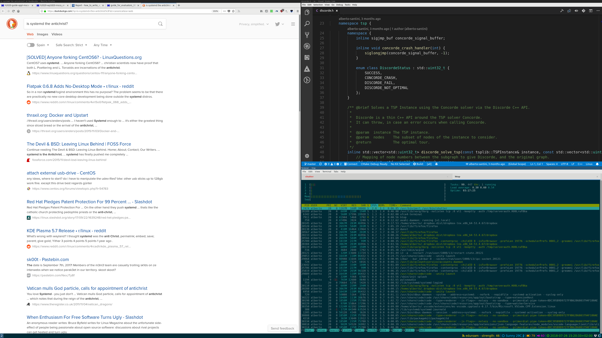

# Various configuration tricks for i3 on a Thinkpad X1 Carbon 4th gen

Here we use Xubuntu 18.04 as base system.



## Running commands at startup

Just add to `~/.config/i3/config` a line with `exec --no-startup-id <command>`, substituting `<command>` with the command you want to run.

## Desktop background

Set the descktop background with `feh`, for example: `feh --bg-fill <file>`.
This can be put in the `config` file for automatic running at startup.

## Keyboard keymap

It can be set with `setxkbmap`, for example: `setxkbmap -layout us -variant altgr-intl`.
This can be put in the `config` file for automatic running at startup.

## Dropbox daemon

Just start it in the `config` file launching `dropbox start`.

## Audio daemon

It can be started simply running `pulseaudio` in the `config` file.

## On-screen notifications

I run the on-screen display daemon dunst which is very lightweight. I just added `exec --no-startup-id dunst` to my `config` file.
I can then send notifications with the `notify-send` command.

## Volume keys

Volume on the current sink can be adjusted with [pulseaudio-ctl](https://github.com/graysky2/pulseaudio-ctl).
It is then just a matter to bind it to the right keys in `config`:

    bindsym XF86AudioRaiseVolume exec --no-startup-id ~/local/bin/volume-set.sh up
    bindsym XF86AudioLowerVolume exec --no-startup-id ~/local/bin/volume-set.sh down
    bindsym XF86AudioMute exec --no-startup-id ~/local/bin/volume-set.sh mute

I wrote a small wrapper around pulseaudio-ctl, so that I can display notifications with dunst.
The script is:

```bash
#!/bin/bash

~/local/bin/pulseaudio-ctl $1

read -r -a status <<< "$(~/local/bin/pulseaudio-ctl full-status)"
volume=${status[0]}
muted=${status[1]}
bar=$(seq -s "─" $(($volume / 5)) | sed 's/[0-9]//g')
icon=""

if [[ $muted = "yes" || $volume = "0" ]]; then
    icon="/usr/share/icons/elementary-xfce-dark/panel/48/audio-volume-muted.png"
elif [[ $volume -lt 35 ]]; then
    icon="/usr/share/icons/elementary-xfce-dark/panel/48/audio-volume-low.png"
elif [[ $volume -lt 70 ]]; then
    icon="/usr/share/icons/elementary-xfce-dark/panel/48/audio-volume-medium.png"
else
    icon="/usr/share/icons/elementary-xfce-dark/panel/48/audio-volume-high.png"
fi

if [[ $muted = "yes" ]]; then
    dunstify -I $icon -r 7414 "    $bar      (muted)"
else
    dunstify -I $icon -r 7414 "    $bar      $volume"
fi
```

## Display brightness keys

Similar to the volume keys, with the following binding:

    bindsym XF86MonBrightnessUp exec xbacklight -inc 20
    bindsym XF86MonBrightnessDown exec xbacklight -dec 20

For it to work with x1's display and Intel graphic card, however, I had to add the following file: `/usr/share/X11/xorg.conf.d/20-backlight.conf`.
Its content is quite straightforward and it is used to tell `xbacklight` that it should look into the `intel_backlight` folder of `/sys/class/backlight`:

    Section "Device"
            Identifier "card0"
            Driver "intel"
            Option "Backlight" "intel_backlight"
            BusID "PCI:0:2:0"
    EndSection

## Skip `lightdm`

If you want to start with a framebuffer shell, and run X only when you need it, disable the login manager with `sudo systemctl disable lightdm.service`.
To run i3 with `startx`, simply `echo i3 > ~/.xinitrc`.

## Configure external monitors

I use the laptop in two modes: with the lid open (regular laptop), or with the lid closed (as a workstation).
When the lid is open I want the regular laptop display, and only that.
When the lid is closed I want to disable the laptop display, and activate my two external displays.
You can use `xrandr` to find out which displays are attached and which resolutions they support.
Then it's very easy to create a small script to put the laptop in lid open/closed mode:

```bash
#!/bin/bash

samsung_monitor="DP-2-2"
lg_monitor="DP-1"
laptop_monitor="eDP-1"

config_closed_lid() {
    xrandr  --output $laptop_monitor --off \
            --output $samsung_monitor --auto --primary \
            --output $lg_monitor --auto --right-of $samsung_monitor
    feh --bg-scale "/home/alberto/Dropbox/Pictures/Backgrounds/Nature and Landscapes/forest-doggo.jpg"
}

config_open_lid() {
    xrandr  --output $samsung_monitor --off \
            --output $lg_monitor --off \
            --output $laptop_monitor --auto --primary
    feh --bg-scale "/home/alberto/Dropbox/Pictures/Backgrounds/Nature and Landscapes/forest-doggo.jpg"
}

if [ "$1" == "lidclosed" ]; then
    config_closed_lid
elif [ "$1" == "lidopen" ]; then
    config_open_lid
else
    echo "Unrecognised action: $1"
fi
```

## Screen lock

i3 provides `i3lock` to lock the display.
You can conveniently bind it to a key combination in the `config` file.
For example: `bindsym $mod+l exec --no-startup-id i3lock`, which binds it to the `Win+L` combination.
You might also want to lock the screen on resume from suspend.
This can be achieved, assuming your system is plagued with the popular `systemd` malware, by placing the following file in `/etc/systemd/system/wakelock.service`:

    [Unit]
    Description=Runs i3lock on system resume from a suspended state
    Before=systemd-suspend.service

    [Service]
    User=alberto
    Type=forking
    Environment=DISPLAY=:0
    ExecStart=/usr/bin/i3lock

    [Install]
    WantedBy=sleep.target
    WantedBy=suspend.target

Just remember to enable it with `sudo systemctl enable wakelock`.

## Bluetooth speaker

I have a paired JBL Flip 2 speaker, with MAC address `B8:69:C2:79:2C:28` (as you can check with `bluetoothctl`).
Surely the following can be automated, but for now I use the manual approach.
I turn on the speaker and then connect to it by issuing, in `bluetoothctl` command line: `connect B8:69:C2:79:2C:28`.
This creates a new sink for pulseaudio, as one can check with `pacmd list-cards` and `pacmd list-sinks`.
Then I put the card in "High Fidelity Audio Sink" mode with `pacmd set-card-profile 2 a2dp_sink` (where `2` is the card number for the JBL speaker).
Finally, I activate the JBL sink with `pacmd set-default-sink 2`.
It is important to notice that I can change sinks even during playback, as I modified the following line in `/etc/pulse/default.pa`:

    load-module module-stream-restore restore_device=false

adding the `restore_device=false` part.

## Status bar

I modified the status bar with i3blocks.
In my `config` file, I put the following:

    bar {
            font pango:FontAwesome-14 14
            status_command i3blocks -c ~/.config/i3/i3blocks.conf
            colors {
                    separator #268bd2
                    background #002b36
                    statusline #839496
            }
    }

Then, in `i3blocks.conf`:

    separator_block_width=14

    [wireless]
    command=echo "<span font_desc='FontAwesome'></span> $(iwgetid -r) - strength: $(cat /proc/net/wireless | tail -n 1 | awk '{print $3}' | rev | cut -c 2- | rev)"
    markup=pango
    color=#FFD600
    interval=30

    [weather]
    command=~/local/bin/i3blocks-weather.sh
    markup=pango
    color=#00BBFF
    interval=1800

    [battery]
    command=~/local/bin/i3blocks-battery.sh
    markup=pango
    color=#FFAA00
    interval=30

    [volume]
    command=~/local/bin/i3blocks-volume.sh
    markup=pango
    color=#FF00EE
    interval=5

    [time]
    command=echo "<span font_desc='FontAwesome'></span> $(date --rfc-3339=seconds)"
    markup=pango
    color=#2DD500
    interval=5

Finally, the three mentioned scripts are `i3blocks-weather.sh`:

```bash
#!/bin/bash

metric=1
location="Barcelona,Spain"
url="http://rss.accuweather.com/rss/liveweather_rss.asp?metric=$metric&locCode=$location"
response=$(curl -s "$url")
weather=$(echo $response | xml_grep '//rss/channel/item/title' --text_only | grep Currently | awk -F ":" '{print $2 $3}' | cut -c 2-)
symbol=""
temperature=""

if [[ $weather = *"Sunny"* ]]; then
    symbol=""
elif [[ $weather = *"Cloud"* || $weather = *"Dreary"* || $weather = *"Flurries"* ]]; then
    symbol=""
elif [[ $weather = *"Shower"* || $weather = *"Storm"* || $weather = *"Rain"* ]]; then
    symbol=""
elif [[ $weather = *"Snow"* || $weather = *"Ice"* || $weather = *"Sleet"* ]]; then
    symbol=""
elif [[ $weather = *"Clear"* ]]; then
    symbol=""
fi

echo "<span font_desc='FontAwesome'>$symbol</span> $weather <span font_desc='FontAwesome'>$temperature</span>"
```

and `i3blocks-battery.sh`:

```bash
#!/bin/bash

level=$(cat /sys/class/power_supply/BAT0/capacity)
charging=$(cat /sys/class/power_supply/BAT0/status)
symbol=""

case $level in
[0-9])
    symbol=""
    ;;
1[0-9])
    symbol=""
    ;;
[2-3][0-9])
    symbol=""
    ;;
[4-5][0-9])
    symbol=""
    ;;
[6-7][0-9])
    symbol=""
    ;;
[8-9][0-9])
    symbol=""
    ;;
100)
    symbol=""
    ;;
*)
    symbol=""
    ;;
esac

if [[ "$charging" = "Charging" ]]; then
    symbol="$symbol "
fi

echo "<span font_desc='FontAwesome'>$symbol</span> $level"
```

and `i3blocks-volume.sh`:

```bash
#!/bin/bash

read -r -a status <<< "$(pulseaudio-ctl full-status)"
volume=${status[0]}
mute=${status[1]}
symbol=""

if [[ $volume = "0" || $mute = "yes" ]]; then
    symbol=""
elif [[ $volume -lt 60 ]]; then
    symbol=""
else
    symbol=""
fi

echo "<span font_desc='FontAwesome'>$symbol</span> $volume"
```

## Use oh-my-zsh themes in the TTY

When on i3, most terminal emulators have good support for UTF-8 fonts and you can easily use the Powerline fonts to obtain all sort of cool effects with oh-my-zsh.
To have the same experience on TTY terminals, I simply downloaded the Terminus font pfs files, patched by Powerline.
They can be found [here](https://github.com/powerline/fonts/tree/master/Terminus/PSF).
After copying the relevant files (in my case, `ter-powerline-v32*`) to `/usr/share/consolefont`, they become usable in ttys.
Since I want this to be a user-specific setting, I put the following in my `.zshrc`:

    # Select the Terminus Powerline Font if we are in a TTY
    case $(tty) in
        (/dev/tty[1-9])
            setfont ter-powerline-v32n
            $HOME/local/bin/tty-solarized-dark.sh
            ;;
    esac

The script `tty-solarized-dark.sh` is used to set the TTY colours to match the *Solarized Dark* popular theme:

    if [ "$TERM" = "linux" ]; then
        echo -en "\e]PB657b83"
        echo -en "\e]PA586e75"
        echo -en "\e]P0073642"
        echo -en "\e]P62aa198"
        echo -en "\e]P8002b36"
        echo -en "\e]P2859900"
        echo -en "\e]P5d33682"
        echo -en "\e]P1dc322f"
        echo -en "\e]PC839496"
        echo -en "\e]PE93a1a1"
        echo -en "\e]P9cb4b16"
        echo -en "\e]P7eee8d5"
        echo -en "\e]P4268bd2"
        echo -en "\e]P3b58900"
        echo -en "\e]PFfdf6e3"
        echo -en "\e]PD6c71c4"
        clear
    fi
